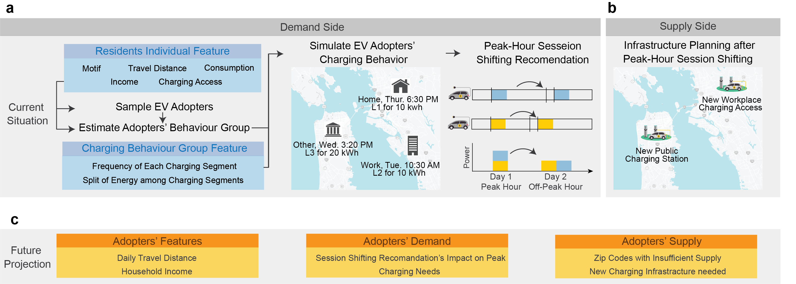

# Planning for 2050: Charging stations to support flexible electric vehicle demand considering individual mobility patterns

## Jiaman Wu, Siobhan Powell, Yanyan Xu, Ram Rajagopal, Marta C. Gonzalez

## Contents

1. [Overview](#Overview)
2. [Setup](#Setup)

<h2 id="Overview">Overview</h2>
With the widespread adoption of electric vehicles (EVs), it is crucial to plan for EV charging in a way that considers both EV driver behavior and the electricity grid's demand. We integrate detailed mobility data with empirical charging preferences to estimate charging demand and demonstrate the power of personalized shifting recommendations to move individual EV drivers' demand on the electricity grid out of peak hours. We find an unbalanced geographical distribution of charging demand in the San Francisco Bay Area, with temporal peaks in both grid off-peak hours in the morning and grid on-peak hours in the evening. Our strategy effectively transfers demand to off-peak charging load, taking advantage of the mobility behavior. 

<p align="center">
  
  <br><i>Figure 1. Overview</i>
</p>

<h2 id="Setup">Setup</h2>

### Installations
In order to install all the required files, create a virtual environment and install the files given in `requirements.txt` file.

```
pip install -r requirements.txt
```

### Running the demo scripts
The structure of code:
- [SimMobility.py](model/SimMobility.py): Mobility simulation based on TimeGeo outputs.
- [SimAdopter.py](model/SimAdopter.py): Simulate demographics of potential adopters, also estimate the probability of being an EV adopter.
- [SimBehavior.py](model/SimBehavior.py): Simulate charging behavior.
- [SimShift.py](model/SimShift.py): Simulate shifting recommendations.
- [SimSensitivity](model/SimSensitivity.py): Conducting sensitivity analysis by changing parameters.
- [AnaMobility.py](analysis/SimMobility.py): Visualize mobility patterns.
- [AnaAdopter.py](analysis/SimAdopter.py): Visualize demographics of potential adopters.
- [AnaBehavior.py](analysis/SimBehavior.py): Visualize charging behavior.
- [AnaShift.py](analysis/SimShift.py): Visualize shifting recommendations' impacts.
- [AnaSensitivity](analysis/SimSensitivity.py): Visualize sensitivity analysis.

To run demo code for simulation and analysis:
- [model/RunMe.ipynb](model/RunMe.ipynb): Charging behavior and shifting recommendation simulation.
- [analysis/RunMe.ipynb](analysis/RunMe.ipynb): Analysis and visualization of simulation results.
