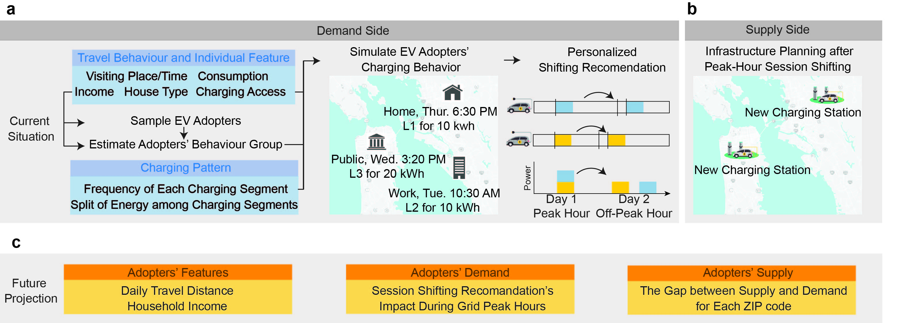
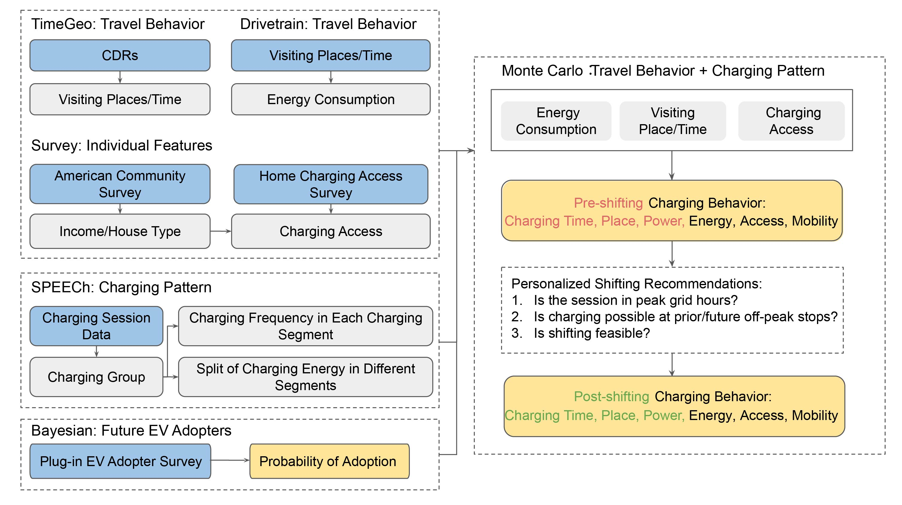

# Planning for 2050: Charging stations to support flexible electric vehicle demand considering individual mobility patterns

#### Jiaman Wu, Siobhan Powell, Yanyan Xu, Ram Rajagopal, Marta C. Gonzalez

## What's this?
With the widespread adoption of electric vehicles (EVs), it is crucial to plan for EV charging in a way that considers both EV driver behavior and the electricity grid's demand. We integrate detailed mobility data with empirical charging preferences to estimate charging demand and demonstrate the power of personalized shifting recommendations to move individual EV drivers' demand on the electricity grid out of peak hours. We find an unbalanced geographical distribution of charging demand in the San Francisco Bay Area, with temporal peaks in both grid off-peak hours in the morning and grid on-peak hours in the evening. Our strategy effectively transfers demand to off-peak charging load, taking advantage of the mobility behavior. 

## Contents

1. [Overview](#Overview)
2. [Dataset](#Dataset)
3. [Method](#Method)
4. [Setup](#Setup)

<h2 id="Overview">Overview</h2>
Overview of the proposed framework for understanding and planning future EV charging needs. (a) We analyze the current charging demand by extracting residents’ travel behavior and individual features, including visiting places and time, energy consumption, income, house type, and charging access, to sample potential EV adopters and assign them a charging behavior group. Based on that, we simulate all EV adopters’ charging behavior in a week, this includes charging location, session start and end time, energy, and power level. We propose personalized shifting recommendations to mitigate the impact of EV charging on grid peak hours. For example, EV adopters may shift their charging sessions from day 1 peak hour to day 2 off-peak hour when feasible. (b) Supply-side management means planning for infrastructure capacity at the ZIP code level, considering demand both before and after the proposed personalized shifting recommendations. (c) Future scenarios capture the evolution of EV adopters’ demographic features, charging demand, and the public charging station supply for increasing adoption rates.
<p align="center">
  
  <br><i>Figure 1. Overview</i>
</p>

<h2 id="Dataset">Dataset</h2>
We use four different datasets in this study: call detail records (CDRs), charging session records, charging infrastructure data, and survey data such as US Census Bureau American Community Survey, the California Plug-in Electric Vehicle Adopter Survey, the California Home Charging Access Survey, and the Clean Vehicle Rebate Project (CVRP) data.

|                          Name                          	| Geograhical<br>Coverage 	| Temporal<br>Coverage 	| Geographical<br>Resolution 	| Temporal<br>Resolution 	| Aggregated<br>Level 	|
|:------------------------------------------------------:	|:-----------------------:	|:--------------------:	|:--------------------------:	|:----------------------:	|:-------------------:	|
|                   Call Detail Records                  	|         Bay Area        	|         2013         	|           Lat,Lon          	|         10-min         	|      Individual     	|
|                Charging Session Records                	|         Bay Area        	|         2019         	|          ZIP code          	|                        	|      Individual     	|
|                  Charging Station Data                 	|        Worldwide        	|         ~2023        	|           Lat,Lon          	|           Day          	|      Individual     	|
|    California Clean Vehicle <br>Rebate Project data    	|        California       	|         ~2023        	|          ZIP code          	|           Day          	|      Individual     	|
|       Census Bureau American <br>Community Survey      	|      United States      	|         ~2022        	|        Census Tract        	|          Year          	|     Census Tract    	|
| California Plug-in Electric <br>Vehicle Adopter Survey 	|        California       	|         2013         	|         California         	|          Year          	|      California     	|
|       California Home Charging <br>Access Survey       	|        California       	|         2022         	|         California         	|          Year          	|      California     	|

<h2 id="Method">Method</h2>
Methodology overview. Dashed frames represent models; blue frames represent the data sources; grey frames represent the intermediate output; and yellow frames represent ultimate output, i.e., original charging demand, charging demand after personalized shifting recommendations, and the probability of each driver being an EV adopter.
<p align="center">
  
  <br><i>Figure 1. Method</i>
</p>

<h2 id="Setup">Setup</h2>

### Installations
In order to install all the required files, create a virtual environment and install the files given in `requirements.txt` file.

```
pip install -r requirements.txt
```

### Running the demo scripts
The structure of code:
- [SimMobility.py](model/SimMobility.py): Mobility simulation based on TimeGeo outputs.
- [SimAdopter.py](model/SimAdopter.py): Simulate demographics of potential adopters, also estimate the probability of being an EV adopter.
- [SimBehavior.py](model/SimBehavior.py): Simulate charging behavior.
- [SimShift.py](model/SimShift.py): Simulate shifting recommendations.
- [SimSensitivity](model/SimSensitivity.py): Conducting sensitivity analysis by changing parameters.
- [AnaMobility.py](analysis/SimMobility.py): Visualize mobility patterns.
- [AnaAdopter.py](analysis/SimAdopter.py): Visualize demographics of potential adopters.
- [AnaBehavior.py](analysis/SimBehavior.py): Visualize charging behavior.
- [AnaShift.py](analysis/SimShift.py): Visualize shifting recommendations' impacts.
- [AnaSensitivity](analysis/SimSensitivity.py): Visualize sensitivity analysis.

To run demo code for simulation and analysis:
- [model/RunMe.ipynb](model/RunMe.ipynb): Charging behavior and shifting recommendation simulation.
- [analysis/RunMe.ipynb](analysis/RunMe.ipynb): Analysis and visualization of simulation results.
